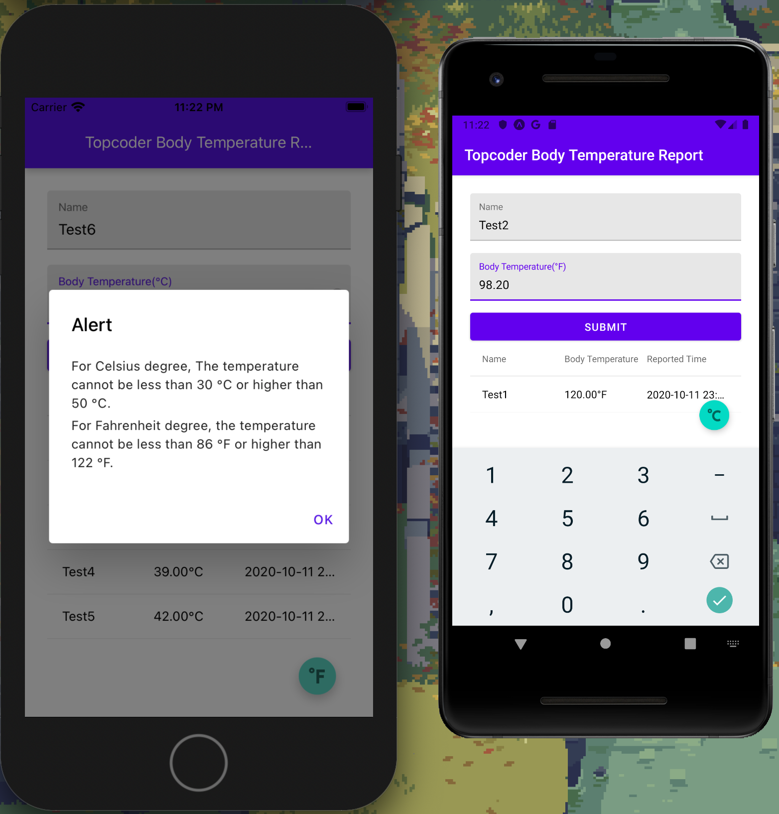

## Body Temp Report

A simple body temperature record app for online challenge.

#### Spec

The app only contains a single screen, which contains

- [x] A header bar, the title should be "Topcoder Body Temperature Report".
- [x] A form that includes the following input controls.
- [x] A text field for inputting the name.
- [x] A text field for inputting the body temperature,it can be in either Celsius or Fahrenheit.You can only input numbers in this text field,the number can only have two decimals at maximum.
- [x] A submit button for reporting the temperature record.
- [x] Once the submit button is clicked, in the below there will be a table with three columns.

- Name
- Body temperature
- Reported time
  - [x] Each record is in a row.
  - [x] There should also be a floating button to switch between Celsius and Fahrenheit.All the temperatures (including the values in the table and input text field) should be converted to the corresponding temperature unit.
  - [x] If the temperature format in the table should be like 37 °C or 100 °F
- [x] You should use Redux to manage the state.
- [x] The temperature cannot be less than 30 °C or higher than 50 °C for Fahrenheit degree, the temperature cannot be less than 86 °F or higher than 122 °F. If the user input temperature is beyond the range, show an error popup with meaningful message text.
- [x] The default temperature unit is Celsius.
- [x] All the state just needs to be stored in memory, so it is expected that the records are gone if we kill the app and reopen it.
- [x] The screen should be responsive to match different screen sizes of devices.
- [x] The app should be able to run on both iOS and Android.

#### Screenshots



[demo](./screenshots/demo.mp4)

#### Run with expo client

- [Android Client](https://play.google.com/store/apps/details?id=host.exp.exponent&referrer=www)
- [iOS Client](https://itunes.apple.com/app/apple-store/id982107779)
- [Project url](https:expo.io/@ike.chang/projects/body-temp-report)

#### Run with snack

- TBD

#### Run locally

```
# Install
yarn global add expo-cli
yarn

# Run on ios
yarn ios
# Run on android
yarn android
```
